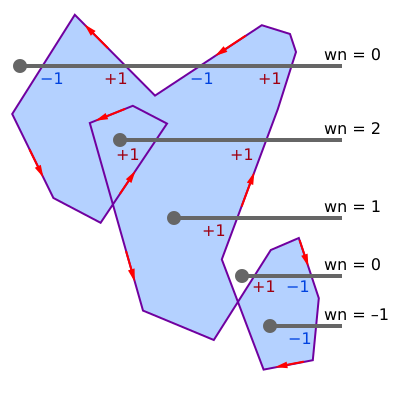

Recentemente comecei a trabalhar na Tecgraf Puc-Rio e precisei resolver um problema interessante: dado um polígono qualquer deseja-se selecionar todos os objetos que estão contidos (inteiramente ou parcialmente) em seu interior. Como fazer isso?

<!-- more -->

## Introdução
Este é um problema geométrico interessante e não me parece muito diferente de determinar se dois objetos estão se intersectando. Como o sistema trabalha num domínio 2D, me parece bem adequado usar o teorema do eixo separador (SAT). Porém, o polígono é genérico, pode ser concavo ou convexo, já o SAT funciona muito bem apenas para polígonos convexos e creio que terá problema para objetos que estejam inteiramente contidos no polígono, que é o caso mais comum. Logo, esta solução exigiria um passo anterior para decompor o polígono em regiões convexas menores usando algoritmos como *Ear Clipping*.

Usar um algoritmo de decomposição me parece muito exagerado para o meu caso. Pesquisando um pouco mais encontrei que determinar se um dos vértices do objeto está contido no polígono seria suficiente para dizer se o objeto intersecta o polígono. O que faz todo sentido, podemos pensar em 4 configurações possíveis que dois objetos podem ter:

1. Vértice-Vértice: este é um caso raro e não estamos muito interessado nele. O vértice do objeto precisa estar exatamente em cima do polígono. Sensível a representação numérica e aos objetos estarem perfeitamente alinhados;
1. Vértice-Aresta: já seria um caso comum e queremos detectar;
1. Aresta-Aresta: outro caso raro que também não estamos interessado, também sensível a representação numérica e aos objetos estarem perfeitamente alinhados;
1. Inteiramente contido: no nosso contexto esse seria o caso mais comum e queremos detectar;

Para os casos que estamos interessados basta que um vértice esteja contido para considerarmos o objeto como selecionado. Dessa forma, reduzimos para um problema de testar ponto-no-polígono, ou seja, para cada vértice basta testarmos se ele está contido no polígono.

## Problema Ponto-no-Polígono
É um problema geométrico fundamental em geometria computacional determinar se um ponto está no interior, exterior ou na fronteira de um polígono 2D. Dois métodos populares para resolver esse problema se baseiam em:

* Número de Cruzamento: conta o número de vezes que um raio cruza as arestas do polígono;
* Número de Voltas: conta o número de voltas que um polígono faz ao redor de um ponto;

Neste texto irei escrever sobre um algoritmo que usa o número de voltas.

## Algoritmo do número de voltas para teste de ponto em polígono
Seja um ponto *Q* qualquer que desejasse testar, um polígono P representado por seus vértices ordenados, no sentido anti-horário, e wn o número de voltas, *Dan Sunday* descreve um algoritmo que traça um raio horizontal *R*, virtual, a partir de *Q*, e toda vez que o raio cruza uma aresta de baixo para cima, wn é incrementado, caso contrário, decrementado. Veja uma ilustração na Figura 1.


    <figure>
        
        <figcaption style="text-align: center">Figure 1: Visualização do algoritmo de números voltas de Dan Sunday. Fonte: Wikepedia, Avelludo</figcaption>
    </figure>


Isso funciona pois ao caminhar pelas arestas de *P* a região à esquerda da aresta é o interior do polígono, e a região à direita o exterior, então se cruzarmos o raio de baixo para cima significa que o ponto **pode** estar no interior, se passarmos de cima para baixo **pode** estar no exterior. Estamos considerando um polígono fechado, caso o ponto esteja do lado de fora é preciso que ele cruze com um aresta subindo e outra descendo, assim elas se cancelam. Dessa forma, caso \\( wn \neq 0 \\) o ponto está no interior, caso contrário, no lado de fora. 

Testar a intersecção entre raio e aresta não é necessária, basta testarmos se o ponto *Q* está à esquerda da aresta. Isso pode ser feito de algumas formas: usando produto interno, produto cruzado, ...  Veja o Algoritmo 1.

```pseudocode 

function wnPoly (Q, P)
    wn = 0

    para cada aresta E de P
        se aresta cruza da baixo para cima
            se Q está a esquerda da aresta E
                wn += 1
        senao aresta cruza de cima para baixo
            se Q está a esquerda da aresta E
                wn -= 1
    
    return wn
```

A complexidade é na ordem de O(n), onde n é o número de vértices do polígono. Como no meu caso o número de vértices do polígonos é bem controlado, raro ter polígonos muito complexos, e sua simplicidade, transformam ele perfeito para resolver o problema.

## Otimizações

## Referências

1. Sunday, D. Inclusion of a Point in a Polygon
1. By Avelludo - Own work, CC BY-SA 4.0, https://commons.wikimedia.org/w/index.php?curid=108280585